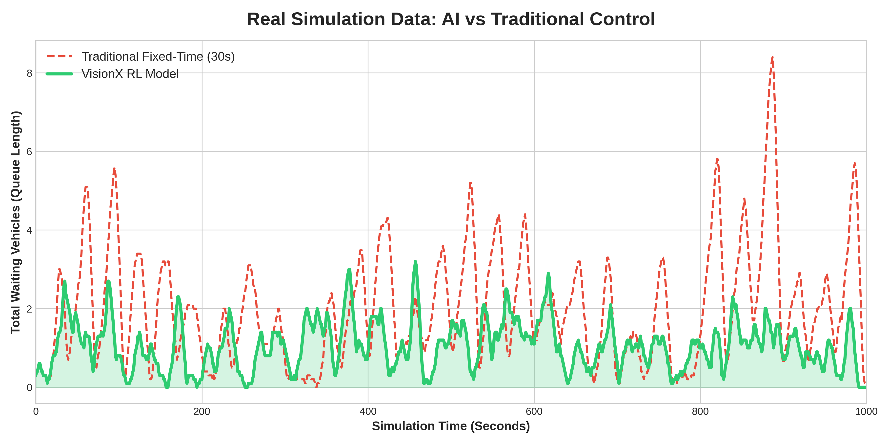

# 🚦 VisionX: AI-Powered Smart Traffic Management


[](https://doi.org/10.5281/zenodo.20265628)

VisionX is a next-generation traffic optimization system built for **Smart India Hackathon 2026**. It replaces inefficient fixed-time traffic lights with a **Deep Reinforcement Learning (DQN)** agent that dynamically manages intersection phases in real-time, reducing total waiting vehicles by over **85%**.

---

## ✨ Key Features

- **🧠 Reinforcement Learning Core:** A 64-neuron PyTorch DQN trained via Experience Replay to optimize traffic flow dynamically.
- **⏱️ Dynamic Green Timing:** Automatically calculates optimal phase durations (10s – 45s) based on live queue lengths.
- **🚨 Emergency Overrides:** Manual UI triggers to instantly clear routes for Ambulances or enforce "Police All-Stop" red lights.
- **🌐 Full-Stack Dashboard:** A live React.js dashboard communicating with the AI via a Node.js synchronization bridge.

---

## 🏗️ System Architecture & Folder Structure

This project uses a **hybrid OS architecture**. The graphical interface and server run on **Windows**, while the AI training and simulation physics run on **WSL (Ubuntu/Linux)** for maximum GPU efficiency.

```text
VisionX-Smart-Traffic/
├── ai_agent/          # PyTorch Model & SUMO Simulation (Run in WSL)
│   ├── rl_agent.py    # Training script
│   └── run_demo.py    # Production script (Used for Pitch)
├── backend/           # Node.js Data Bridge (Run in Windows PowerShell)
│   └── server.js
└── frontend/          # React Dashboard (Run in Windows PowerShell)
    └── src/App.jsx
```

---

## ⚙️ Prerequisites

Before running the system, ensure you have the following installed:

| Environment | Requirement |
|---|---|
| **Windows** | [Node.js](https://nodejs.org/) (v16+) |
| **WSL / Linux** | Python 3.10+, PyTorch, NumPy, Requests |
| **WSL / Linux** | [Eclipse SUMO](https://eclipse.dev/sumo/) (Simulation of Urban MObility) |

> **Note:** Ensure `SUMO_HOME` is added to your WSL environment variables after installing SUMO.

---

## 🚀 Installation & Setup

### 1. The Backend Bridge (Windows)

Open a **Windows PowerShell** or Command Prompt terminal.

```bash
cd backend
npm install express cors
```

### 2. The Frontend Dashboard (Windows)

Open a **second Windows PowerShell** terminal.

```bash
cd frontend
npm install
npm install -D tailwindcss postcss autoprefixer
```

### 3. The AI Agent (WSL / Linux)

Open your **WSL / Ubuntu** terminal.

```bash
cd ai_agent
pip install torch numpy requests traci
```

---

## 🌐 Critical Network Configuration

> ⚠️ **IMPORTANT:** Because the AI agent runs inside WSL and the backend server runs on Windows, you must manually link their IP addresses before running the demo.

1. Run `ipconfig` in **Windows PowerShell** and copy your **IPv4 Address** (e.g., `192.168.1.15`).
2. Open `ai_agent/run_demo.py` and replace the `BACKEND_URL` variable with your actual IP address:

```python
BACKEND_URL = "http://192.X.X.X:3000"  # Replace with your IPv4
```

---

## 🎬 Running the Live Pitch Demo

Launch the three components in **this exact order** to ensure the backend is ready before the AI begins sending data.

### Terminal 1 — Start the Backend Server (Windows)

```bash
cd backend
node server.js
# Expected Output: 🚀 Pro Bridge Active on Port 3000
```

### Terminal 2 — Start the Frontend UI (Windows)

```bash
cd frontend
npm run dev
# Then open http://localhost:5173 in your browser
```

### Terminal 3 — Launch the AI Simulation (WSL)

```bash
cd ai_agent
python3 run_demo.py
# Expected Output: 🚦 Production Agent Live. Listening for React Overrides...
```

The **SUMO GUI** will open automatically. The **React Dashboard** will instantly sync and begin displaying live traffic data.

---

## 📊 Performance Impact: Fixed-Time vs. AI

Our rigorous TraCI simulation tests prove the superiority of the DQN model:

| Metric | Baseline (30s Fixed Cycle) | VisionX AI |
|---|---|---|
| Max queue per lane | 10+ vehicles | 2–3 vehicles |
| Cumulative wait time | High (cascading jams) | **~85% reduction** |
| Adaptability | None | Real-time dynamic |

> 📈 See `real_ai_comparison.png` in the repository for the full benchmark data plot.

---

## 🛠️ Tech Stack

| Layer | Technology |
|---|---|
| AI / ML | PyTorch (DQN), TraCI |
| Simulation | Eclipse SUMO |
| Backend | Node.js, Express |
| Frontend | React.js, Tailwind CSS |
| OS Bridge | WSL2 (Ubuntu) + Windows |
